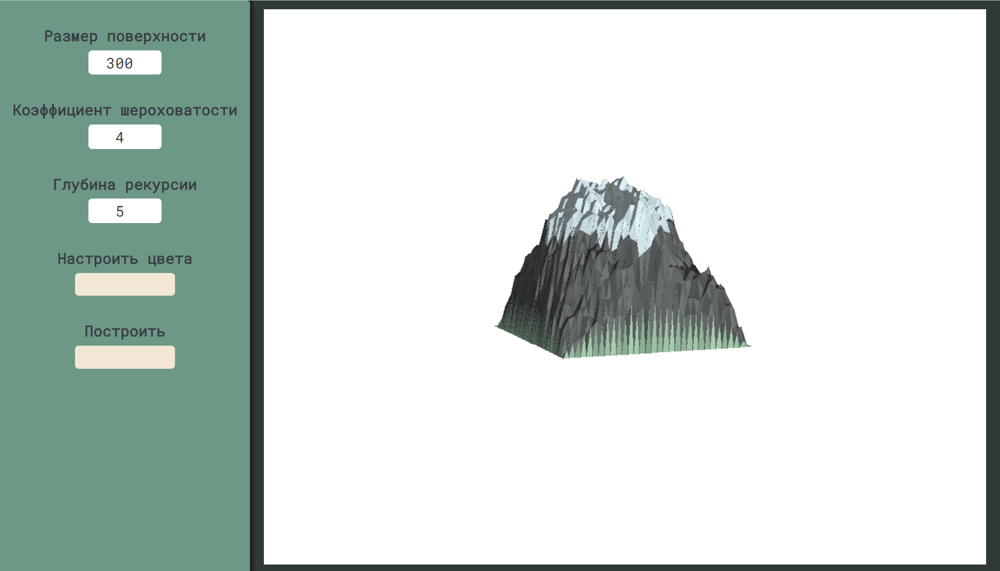

# Курсовая работа по компьютерной графике "Построение фрактальных поверхностей"

Этот проект посвящен созданию фрактальных поверхностей в компьютерной графике.

## Деплой

Проект развернут и доступен на GitHub Pages по следующему URL-адресу: https://mywebsite.

## Описание проекта

В работе были использованы следующие методы:

- **Алгоритм Z-буфера**: для удаления скрытых линий и поверхностей.
  
- **Алгоритм Diamond-Square**: для генерации фрактальных ландшафтов и поверхностей.

- **Модель Ламперта для освещения**: для создания эффекта объемности.

- **Теневые карты**: для добавления теней.

Методы были реализованы без использования сторонних библиотек.

## Используемые технологии

- Язык программирования: JavaScript.
- Библиотека для работы с матрицами и векторами: gl-matrix.

## Ограничения

Проект нельзя посмотреть и использовать на устройствах с разрешением меньше 1390 х 810
